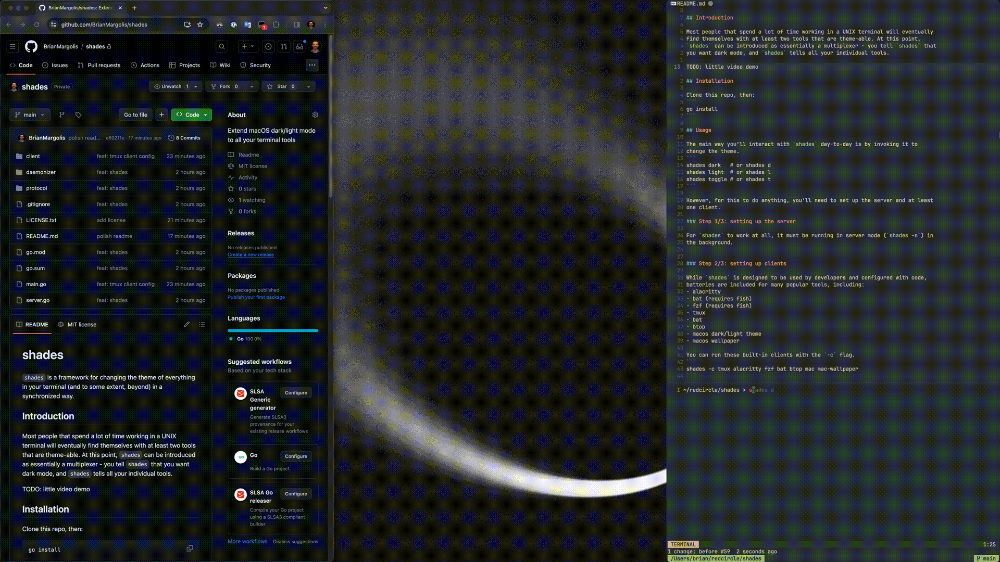

# shades 

`shades` is a framework for changing the theme of everything in your terminal
(and to some extent, beyond) in a synchronized way. 

## Introduction

Most people that spend a lot of time working in a UNIX terminal will eventually
find themselves with at least two tools that are theme-able. At this point,
`shades` can be introduced as essentially a multiplexer - you tell `shades` that
you want dark mode, and `shades` tells all your individual tools.

A little demo of shades - this is toggling the theme in six separate components at once (neovim, neovim status line, tmux, alacritty, the wallpaper, and mac dark/light itself - which [dark reader](https://chromewebstore.google.com/detail/dark-reader/eimadpbcbfnmbkopoojfekhnkhdbieeh) syncs over to Chrome):


## Installation 

Clone this repo, then:
```
go install
```

## Usage

The main way you'll interact with `shades` day-to-day is by invoking it to
change the theme.
```
shades dark   # or shades d
shades light  # or shades l
shades toggle # or shades t
```

However, for this to do anything, you'll need to set up the server and at least
one client.

### Step 1/3: setting up the server

For `shades` to work at all, it must be running in server mode (`shades -s`) in
the background.  


### Step 2/3: setting up clients 

While `shades` is designed to be used by developers and configured with code,
batteries are included for many popular tools, including:
- alacritty
- bat (requires fish)
- fzf (requires fish)
- tmux
- bat 
- btop
- macos dark/light theme
- macos wallpaper  

You can run these built-in clients with the `-c` flag.
```
shades -c tmux alacritty fzf bat btop mac mac-wallpaper 
```

You can get a list of all available clients with the `-l` flag.
```
shades -l 
```

The `shades.nvim` plugin enables theming Neovim, and provides a second example
of implementing a `shades` client. See more about implementing your own clients in the next section.

### Step 3/3: daemonizing (optional but highly recommended)

You can experiment with `shades` by just running `shades -s` and `shades -c
...` in a terminal, but my recommendation is that you eventually daemonize both
of these.

This repo provides a TUI to automate this called `shades-daemonizer`, but it
only supports Macs/`launchd` at the moment. To install the TUI, open up the
`daemonizer` directory and run `go install`. Then run with a simple
`shades-daemonizer` - you can re-run as needed to edit the configuration of the
daemon.

## Configuration
`shades` is configured with a yaml file - an example can be found in this repo
(`shades.yaml`). `shades` will look for this file in:
1. the path that `SHADES_CONFIG` is set to
2. if that's empty, `$HOME/.config/shades/shades.yaml`

## Implementing your own clients

Because UNIX sockets are a widely supported transport technology, and the
protocol we build on top of it is trivial to implement in any language, you can
integrate just about anything you can control programmatically with this
framework. 

My recommendation is that you default to building these in Go with the same
structure that the built in clients use. Basically, if you can fill out this
method:
```go
func (f FooClient) SetTheme(theme string) error {}
```
with code that themes the thing you want themed, then you should do that. 

### Protocol

`shades` uses a simple plain text protocol with 5 `verb:noun` messages:
1. `subscribe:name` - begin receiving `set` messages
2. `unsubscribe:` - stop receiving `set` messages
3. `set:{theme}` - can only be sent by the daemon, a client should re-theme
   based on the value of `theme`
4. `propose:{theme}` - this is a request from a client to change the theme,
   which is useful for giving things like neovim interactive control over the
   theme
5. `get:{theme}` - firing this will result in the server firing a `set` back,
   useful in the startup context

Each message is delimited by a `\n` character.

`propose` and `get` are optional; the simplest client just
`subscribe`s, waits for and acts open any `set`, and fires an `unsubscribe` on
shutdown.


## TODOs
- [ ] turn the neovim stuff into a proper plugin
- [ ] basic configuration - stuff like paths
- [ ] advanced behavioral configuraton
- [x] launchd setup script - want it to be nice and interactive, and ideally
  not fish specific
- [ ] write tool to more intelligently hunt down the alacritty theme - maybe we
  just have a build step that pre-pends the theme import.. ugly and now we're
  really dependent on `shades` to run alacritty at all.. maybe this is a
  separate tool?
- [ ] make clients poll server for a bit before giving up - right now if the
  server isn't up, the clients just immediately die, and it would be nice to
  just start both simultaneously.
