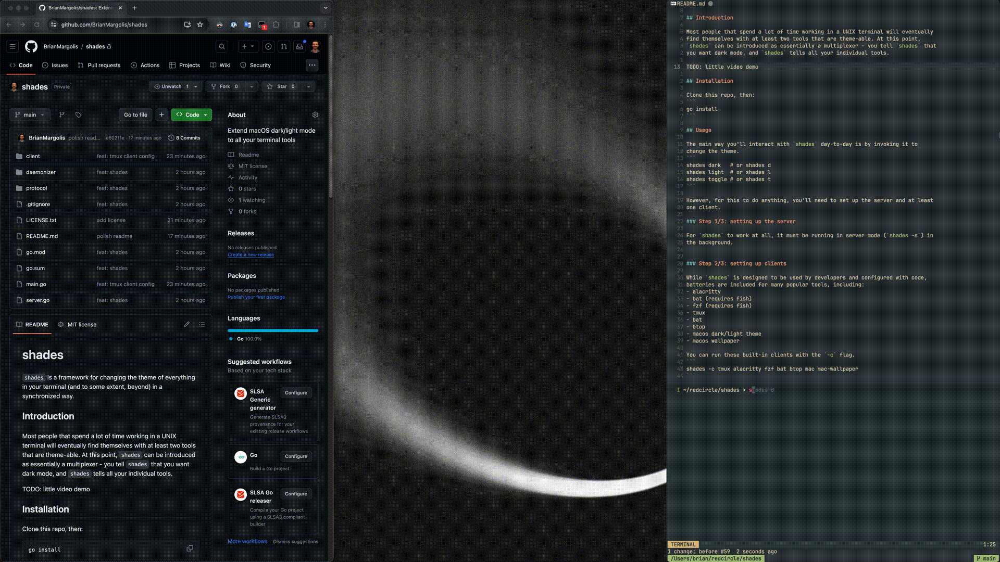

# shades

`shades` is a framework for changing the theme of everything in your terminal
(and to some extent, beyond) in a synchronized way.

## Introduction

Most people that spend a lot of time working in a UNIX terminal will eventually
find themselves with at least two tools that are theme-able. At this point,
`shades` can be introduced as essentially a multiplexer - you tell `shades` that
you want dark mode, and `shades` tells all your individual tools.

A little demo of shades - this is toggling the theme in six separate components at once (neovim, neovim status line, tmux, alacritty, the wallpaper, and mac dark/light itself - which [dark reader](https://chromewebstore.google.com/detail/dark-reader/eimadpbcbfnmbkopoojfekhnkhdbieeh) syncs over to Chrome):


## Installation

Clone this repo, then:

```sh
go install
```

`shades` needs a config file to do anything - see
[Configuration](#configuration). The `shades.yaml` in this repo is a working
example to copy.

## Usage

The main way you'll interact with `shades` day-to-day is by invoking it to
change the theme.

```sh
shades dark   # or shades d
shades light  # or shades l
shades toggle # or shades t
```

Themes are identified as `theme;variant`, and `dark`/`light` are just shorthand
for the two you've nominated as defaults in your config. You can set any theme
directly, list them all, or preview one:

```sh
shades set everforest;dark-medium
shades -l                            # every theme;variant in your config
shades preview everforest;dark-medium # print the palette as swatches
```

There's also an interactive picker, which is an `fzf` window that previews each
theme as you move through the list and applies the one you pick.

```sh
shades interactive        # or shades i
shades i --dark           # only dark variants (--light for light)
shades i --tmux           # use fzf-tmux, i.e. a floating tmux window
```

However, for any of this to do anything, you'll need to set up the server and at
least one client.

### Step 1/3: setting up the server

For `shades` to work at all, it must be running in server mode (`shades -s`) in
the background.

### Step 2/3: setting up clients

While `shades` is designed to be used by developers and configured with code,
batteries are included for many popular tools:

- alacritty
- bat (requires fish)
- btop
- claude code
- firefox
- fzf (requires fish)
- ghostty
- macos dark/light theme
- macos wallpaper
- tmux
- template (renders arbitrary files, for anything without a dedicated client)

You run these built-in clients with the `-c` flag.

```sh
shades -c tmux ghostty fzf bat btop claude mac mac-wallpaper
```

The [`shades.nvim`](https://github.com/BrianMargolis/shades.nvim) plugin
enables theming Neovim, and provides a second example of implementing a
`shades` client. See more about implementing your own clients in the next
section.

### Step 3/3: daemonizing (optional but highly recommended)

You can experiment with `shades` by just running `shades -s` and `shades -c
...` in a terminal, but my recommendation is that you eventually daemonize both
of these.

```sh
shades install   # or `just install`, which does a go install first
shades uninstall
```

This registers two launchd agents (one for the server, one for the clients
listed under `daemon.enabled-components` in your config) that start at login and
restart if they crash. It's macOS-only at the moment. Logs land in
`~/.shades/logs`; `just tail-logs` will follow them.

## Configuration

`shades` is configured with a yaml file - an example can be found in this repo
(`shades.yaml`). `shades` will look for this file in:

1. the path that `SHADES_CONFIG` is set to
2. if that's empty, `$HOME/.config/shades/shades.yaml`

The top-level keys are:

- `socket-path` - where the server listens
- `defaultDarkTheme` / `defaultLightTheme` - what `shades dark`, `shades light`
  and `shades toggle` resolve to, as `theme;variant`
- `themes` - your palettes (see below)
- `client` - per-client settings, keyed by client name
- `templates` - files for the `template` client to render
- `daemon.enabled-components` - which clients `shades install` runs

A theme is a named set of variants, and a variant is a `light: true|false` flag
plus a palette. Every variant defines the same color names, which is what lets
one config drive every client:

```yaml
themes:
  everforest:
    name: "everforest"
    variants:
      dark-medium:
        light: false
        colors:
          BG0: "#2D353B"
          FG: "#D3C6AA"
          # ... BGDIM, BG1-BG5, RED, ORANGE, YELLOW, GREEN, BLUE, AQUA,
          # PURPLE, GRAY1-GRAY3
```

Anything without a dedicated client can usually be handled by the `template`
client, which renders a file per entry in `templates`. Placeholders are color
names wrapped in `escape-char` on both sides, so with `escape-char: "%"`,
`%RED%` becomes `#E67E80` and `%RED_HEX%` becomes `E67E80` (for consumers like
GLSL that can't take a literal `#`).

```yaml
templates:
  - template-path: "~/dotfiles/kitty/kitty.conf.template"
    output-path: "~/.config/kitty/kitty.conf"
    escape-char: "%"
```

## Implementing your own clients

Before you write any code, check whether the `template` client can do the job.
If the tool you want themed reads its colors out of a config file, you can add a
few lines of yaml (see [Configuration](#configuration)), sprinkle placeholders
through a copy of that config, and be done. No Go, no socket handling, nothing
to maintain as `shades` changes. Many of my clients could have been templates;
the ones that aren't are the ones that need to poke a running process or shell
out to something.

When that isn't workable, because UNIX sockets are a widely supported transport
technology, and the protocol we build on top of it is trivial to implement in
any language, you can integrate just about anything you can control
programmatically with this framework.

My recommendation is that you default to building these in Go with the same
structure that the built in clients use (when templating fails). Basically, if
you can fill out this method:

```go
func (f FooClient) SetTheme(theme string) error {}
```

with code that themes the thing you want themed, then you should do that.

### Protocol

`shades` uses a simple plain text protocol with 6 `verb:noun` messages:

1. `subscribe:{name}` - begin receiving `set` messages
2. `unsubscribe:` - stop receiving `set` messages
3. `set:{theme}` - can only be sent by the daemon, a client should re-theme
   based on the value of `theme`
4. `palette:{json}` - can only be sent by the daemon, the colors of the theme
   that the next `set` names, as a JSON object of color name to hex string
   (`{"BG0":"#2D353B","FG":"#D3C6AA",...}`)
5. `propose:{theme}` - this is a request from a client to change the theme,
   which is useful for giving things like neovim interactive control over the
   theme
6. `get:` - firing this will result in the server firing a `palette` and then a
   `set` back, useful in the startup context

Each message is delimited by a `\n` character. Only the first `:` delimits the
verb, so a noun is free to contain colons, as the `palette` payload does.

`palette` always arrives immediately before the `set` it describes, so a client
has the colors in hand by the time it's told to re-theme. It's there for clients
that can't read `shades.yaml` themselves and would otherwise need their own copy
of every palette. Clients built on the Go helpers in this repo read the config
directly and ignore it.

`palette`, `propose` and `get` are optional; the simplest client just
`subscribe`s, waits for and acts on any `set`, and fires an `unsubscribe` on
shutdown.
